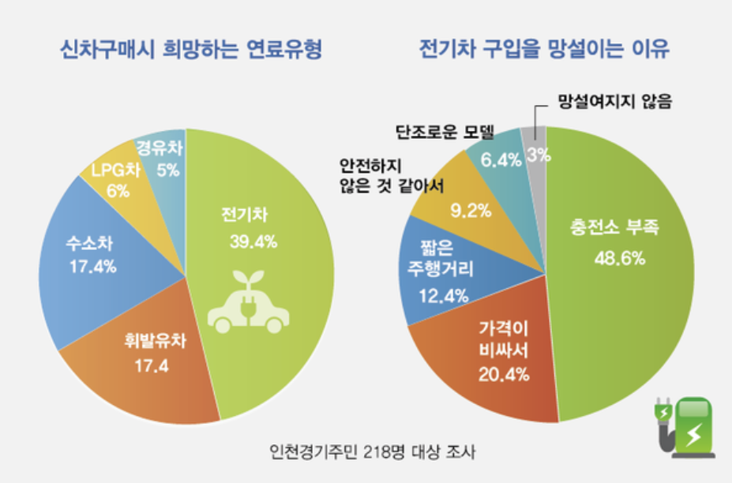
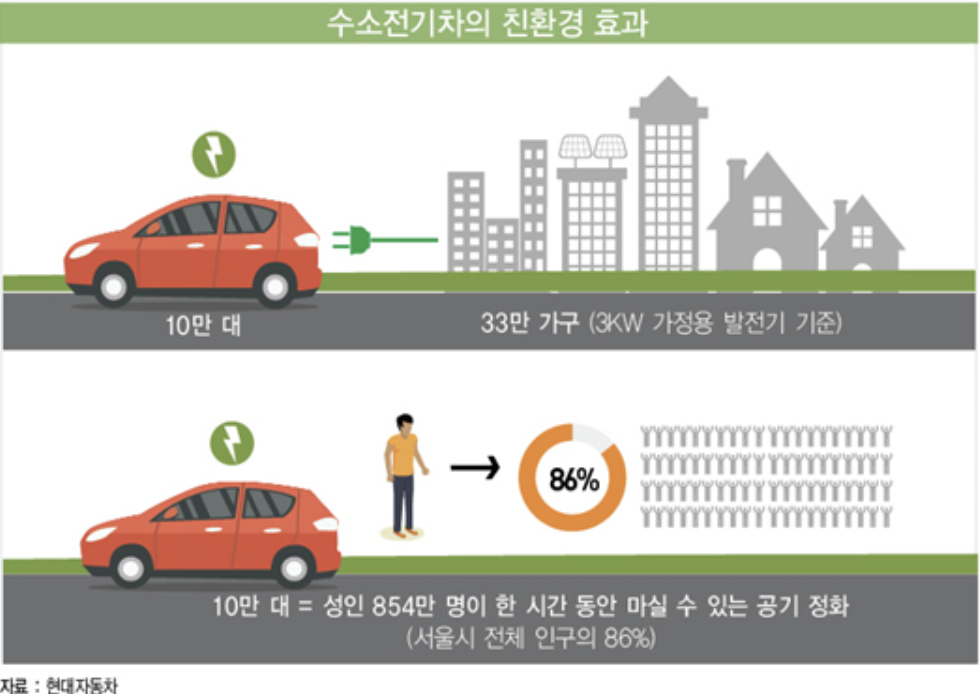
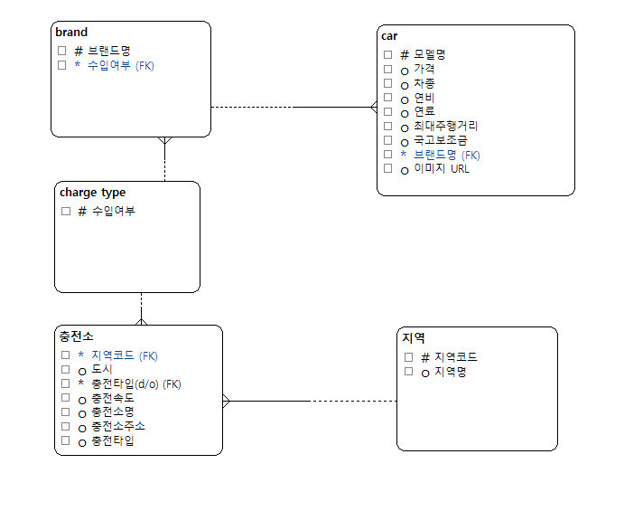
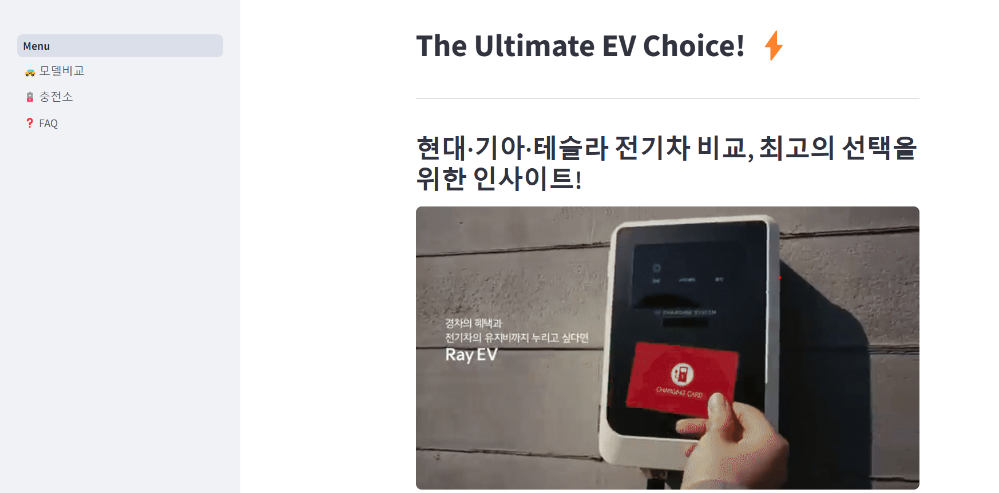
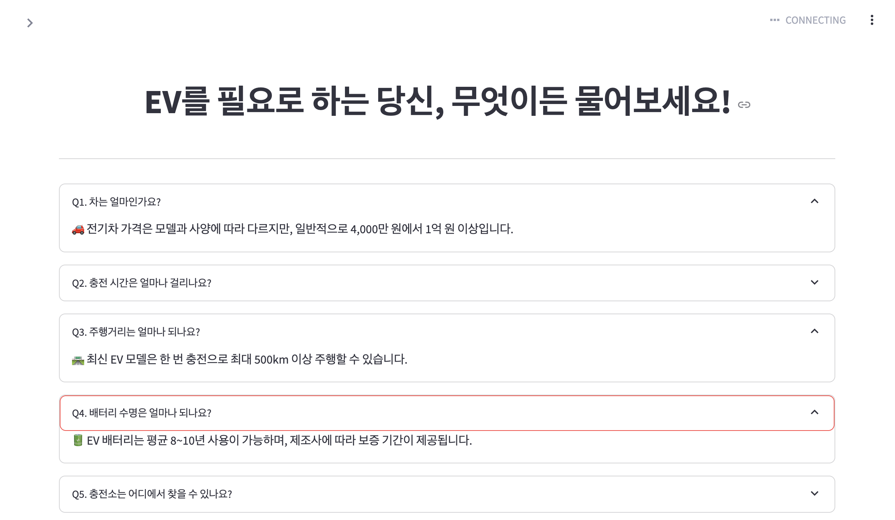

# SKN011-3rd-1Team

---
# 팀소개

| 이현대 | 안종현 | 방성일 | 홍성욱 | 신진슬 |
|--------|--------|--------|-------|--------|
|  |  |  |  |  |

---
# ⚡ 전기차 구매 가이드 FAQ: 모델 성능, 보조금 & 지역별 중전소 정보
* 📅개발기간: 2025.02.26 ~ 02.27
---

## 목차
1. 프로젝트 개요
    1) 프로젝트 필요성
    2) 프로젝트 목표
2. 프로젝트 내용
    1) 사용 기술
    2) ERD
    3) 프로젝트 수행 결과

---

## 1. 📜 프로젝트 개요
 * 국내 주요 전기차 모델에 대한 정보를 종합적으로 제공하고, 해당 차량 구매 시 적용 가능한 국가 보조금 정책을 안내함으로써 소비자의 합리적인 전기차 선택 지원.
 * 지역별 전기차 충전소 분포 정보를 제공하여 소비자들이 충전 인프라를 고려한 구매 결정 보조.
 * 전기차 구매에 대한 실질적인 정보 접근성 향상을 통해 전기차 보급 촉진.

### 1) 💡 프로젝트 필요성
 * 내연기관 자동차의 화석 연료 연소 과정에서 발생하는 온실가스와 미세먼지는 기후변화를 가속화하고 호흡기질환 등의 건강 문제를 초래함. 이에따라 화석 연료를 사용하지 않는 친환경 자동차의 도입과 보급의 확대가 요구됨.

  

 * 전기차는 에너지 효율이 높아 친환경 자동차 중 가장 보급 가능성이 높은 자동차로 평가되어, 정부는 전기차 구매 시 보조금을 적극적으로 지원하고 있음. 하지만, 소비자들은 전기차의 성능, 보조금 정책, 충전 인프라 등 핵심 정보에 대한 접근성이 부족하여 구매 결정에 어려움을 겪고 있는 실정임.
 * 소비자 설문조사 결과 전기차 구입을 망설이는 가장 큰 이유로 충전인프라, 가격, 주행거리 등 이 선정됨.

  

 * 이에따라, 소비자들이 전기차 구매 시 가장 궁금해하는 정보를 직접적으로 비교할 수 있도록 대표적인 국내 전기차 모델들의 성능, 정부 보조금, 그리고 국내 충전 인프라 현황에 대한 종합적인 정보를 제공하고자 함.

### 2) 🎯 프로젝트 목표

 💿 국내 전기차 모델 성능, 국내 충전 인프라 현황 데이터베이스 구축 (용어 검토 필요) 
   - 국내 전기차 모델의 성능 정보 및 국내 충전 인프라 현황을 웹 크롤링하여 데이터를 수집하고, 이를 바탕으로 통합 데이터베이스를 구축함.

 📊 국내 전기차 모델 성능 비교 제시
   - 소비자가 관심있는 두 가지 전기차 모델을 선택하여 성능(배터리 용량, 연비 등)과 정부 보조금 정보를 직관적으로 비교할 수 있도록 데이터 시각화 플랫폼을 구축함.

 🗺️ 국내 충전 인프라 현황
   - 국내 전기차 충전 인프라 현황을 직관적으로 확인할 수 있도록 지도 기반 그래프 형태로 정보를 제시함.

 ❓ 전기차 구매 보조를 위한 통합 정보 FAQ
   - 전기차 구매 시 소비자들이 주로 궁금해하는 다양한 정보를 종합하여 FAQ 형태로 정리함.

     

## 2. 💻 프로젝트 내용

### 1) 🛠️ 사용 기술
  | | | | |||

### 2) 🕸️ ERD
  

  
  

### 3) 🖼️ 프로젝트 수행 결과
 * 메인화면
  

  
  

  
 * 자동차 모델 비교
  

  
  

 * 충전소 정보
  

  
  

 * 종합 정보 FAQ
  

  
  

